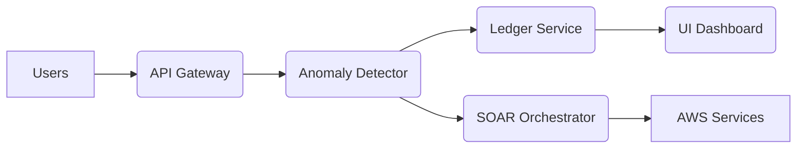
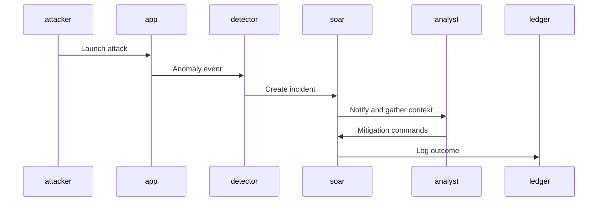

# TrustVault – End-to-End Demo

---

## Architecture Overview



---

## Monitoring & Metrics


---

## Demo Sequence

```typescript
const socket = new WebSocket('wss://demo.trustvault.ai/alerts');

socket.onmessage = (event) => {
  const data = JSON.parse(event.data);
  console.log('Alert received', data);
};
```

```json
{
  "id": "01F4",
  "src_ip": "10.2.1.5",
  "severity": "HIGH"
}
```

---

## Response Workflow



---

## Feedback Loop

- Mark false positives directly in UI
- Feedback stored in dataset for next model run
- Nightly retraining updates anomaly scoring

---

## Thank You

- Dashboard: https://console.aws.amazon.com/grafana/
- UI: https://trustvault-demo.awsapps.com
- Contact: demo@trustvault.ai

