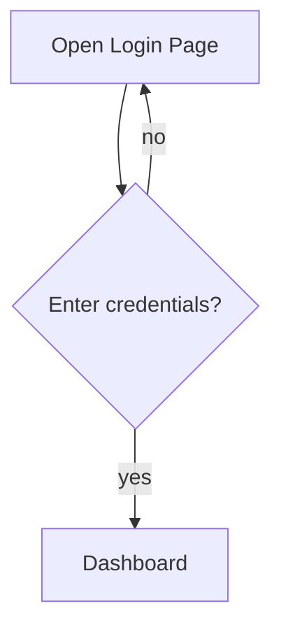
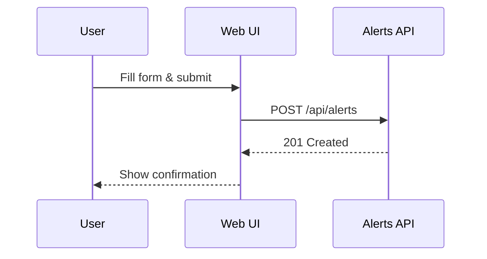
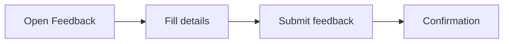

# TrustVault User Walkthrough

Welcome to the TrustVault platform. This guide walks you through the basic UI workflow from logging in to submitting feedback.

## 1. Logging In

1. Navigate to [https://app.trustvault.io](https://app.trustvault.io).
2. Enter your **email** and **password**.
3. Click **Login**.

## 2. Triggering Alerts

1. From the dashboard, open the **Alerts** tab.
2. Click **New Alert** and fill in the form.
3. Press **Create** to trigger the alert.
4. Verify a success notification appears.

## 3. Feedback Flow

1. Click your avatar and choose **Send Feedback**.
2. Describe any issues or suggestions.
3. Submit the form to send feedback to the team.

<!--
Screencast Outline (approx. 7 minutes):
0:00 - 0:30 Introduction and login page overview
0:30 - 1:30 Demo logging in and viewing the dashboard
1:30 - 3:30 Create a new alert and confirm notification
3:30 - 5:00 Walk through existing alerts list
5:00 - 6:30 Open feedback dialog and submit example feedback
6:30 - 7:00 Wrap up and where to find more help
-->
