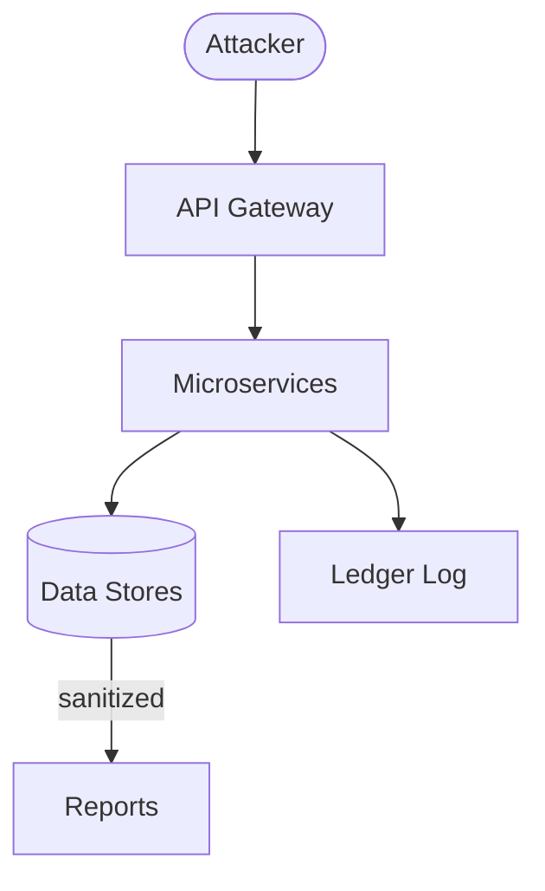

This guide outlines our quarterly security scanning and penetration testing program.

## Automated Scans

- **Monthly Docker scans** using [`trivy`](https://aquasecurity.github.io/trivy/):
  ```bash
  trivy image --severity CRITICAL,HIGH --exit-code 1 <image-name>
  ```
  These run in CI for each built image.
- **Quarterly AWS Inspector runs** for EC2/EKS resources:
  ```bash
  aws inspector2 start-assessment-run --resource-group-arn <group-arn>
  ```

## External Penetration Testing

1. **Scope**: APIs, web UI, and infrastructure components.
2. **Engagement timeline**: one week of testing per quarter, followed by a final report within two weeks.
3. **Deliverables**: detailed findings report and remediation recommendations.

## Remediation Process

1. Log all findings in [`/backlog/security-bugs.md`](../backlog/security-bugs.md).
2. Assign an owner and track status with target fix dates.
3. Critical issues must be fixed within **7 days**; high severity within **30 days**.

### Escalation Matrix

| Severity | Escalation Path | Response Time |
|----------|-----------------|---------------|
| Critical | Notify security officer and on-call immediately. | &lt;24&nbsp;h |
| High     | Assign to service owner; review in next sprint. | 7&nbsp;d |
| Medium   | Triage during monthly review meeting. | 30&nbsp;d |
| Low      | Document for future improvement. | Best effort |

## Threat Model



